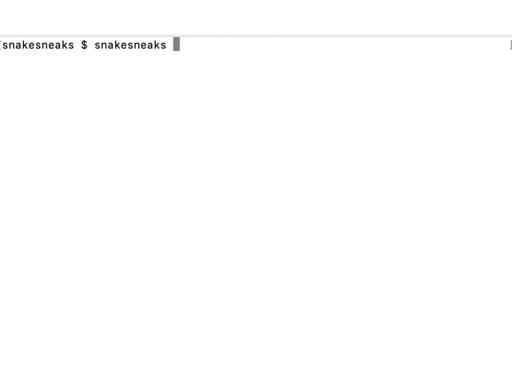

# snakesneaks-cmd
- 暇つぶしに作った、ヘビが出てくるだけのコマンド

# 使い方
- バイナリの取得&実行
    - 次のどちらかの方法でバイナリを取得してください
        1. github UI上のreleaseからバイナリ(`bin/`配下の適切なバイナリ)をダウンロードして実行
        2. `go install github.com/snakesneaks/snakesneaks-cmd@latest`して実行
        3. 手元でビルドして実行

- ヘビからのおすすめ: 
    - `go install github.com/snakesneaks/snakesneaks-cmd@latest && mv $(go env GOPATH)/bin/snakesneaks-cmd $(go env GOPATH)/bin/snakesneaks`